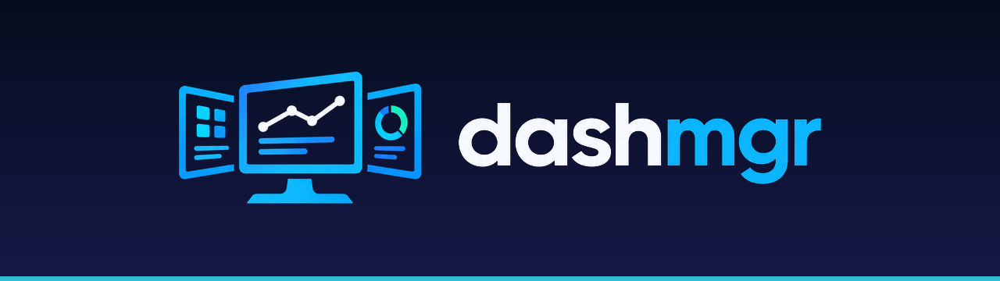
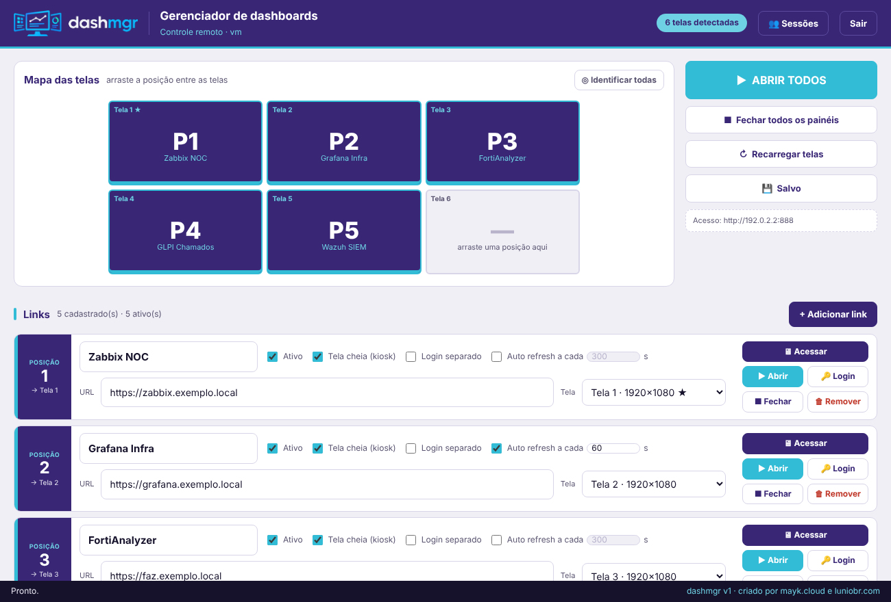
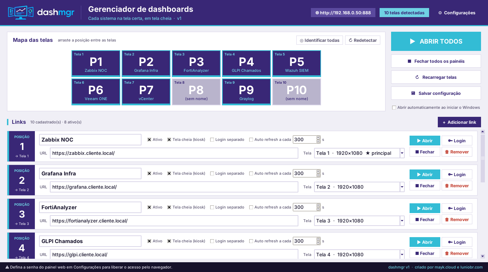
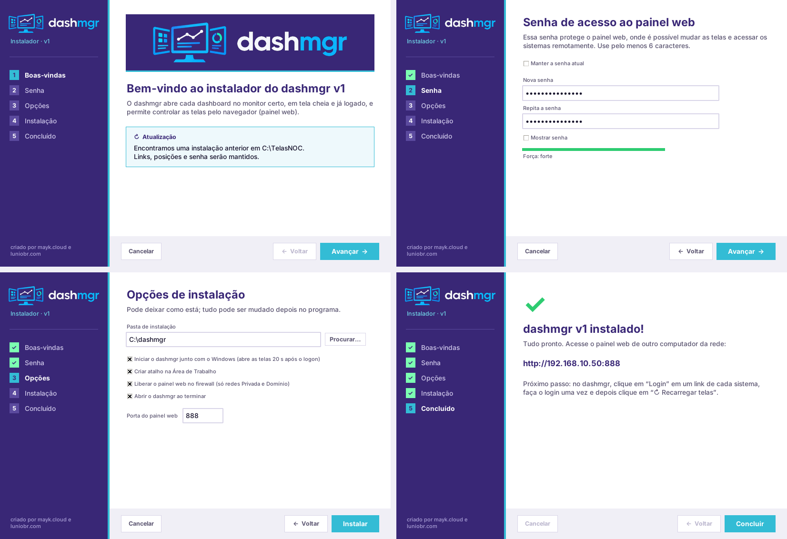
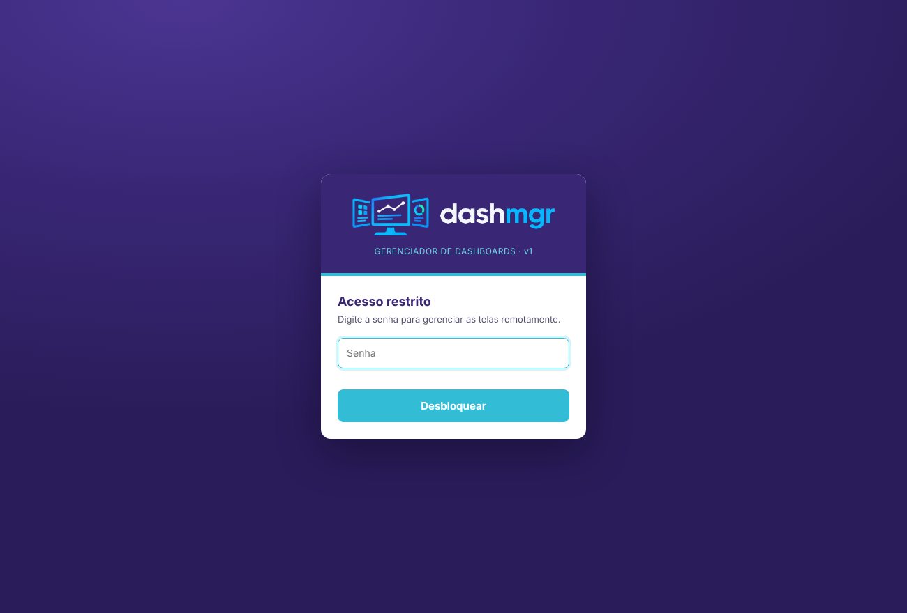
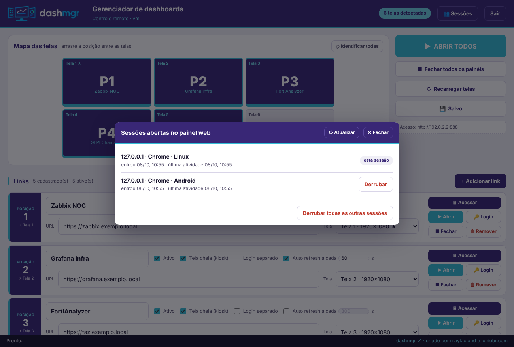
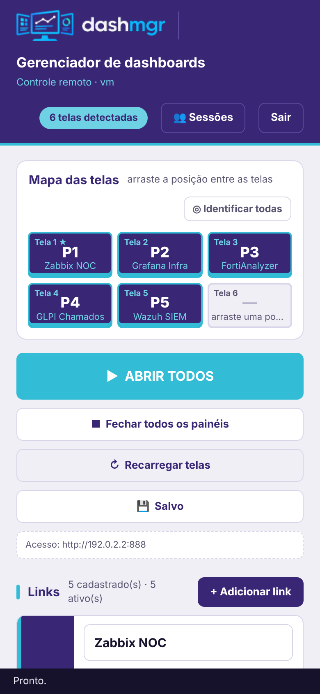
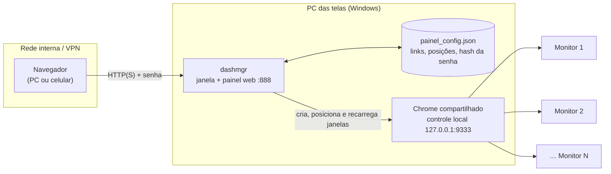

<p align="center">
  
</p>

<p align="center">
  <a href="LICENSE"></a>
  
  
  
</p>

**dashmgr** abre cada dashboard no **monitor certo**, em **tela cheia** e **já logado**, e deixa você controlar a parede de telas do NOC **pelo navegador**, de qualquer computador ou celular da rede.

Foi feito para uma situação comum: um PC com vários monitores (Grafana, Zabbix, FortiAnalyzer, GLPI, SIEM…) em que alguém, todo dia, abre 10 janelas do Chrome, arrasta cada uma para o monitor certo, coloca em tela cheia e faz login em cada sistema. O dashmgr faz isso sozinho e mantém tudo funcionando.

<p align="center">
  
</p>

---

## Recursos

**Telas**

- **Um link por monitor, em tela cheia**, aberto com um clique ou automaticamente quando o Windows inicia.
- **Mapa das telas com arrastar e soltar.** Cada link tem uma *posição* fixa (P1, P2…). Você arrasta a posição até o monitor desejado, e se ele já estiver ocupado os dois links trocam de lugar.
- **Monitores reconhecidos pelo hardware.** O vínculo continua certo mesmo que o Windows mude a numeração das telas.
- **Mudanças aplicadas na hora.** Trocar posição, URL ou desativar um link mexe **só nas telas envolvidas**, sem reiniciar as outras.
- **Auto refresh por link**, com o intervalo em segundos.

**Login**

- **Login compartilhado.** Todas as telas usam um único Chrome com o mesmo perfil, então você faz login uma vez em cada sistema e ele vale para todas.
- **Login separado (opcional)** para quando um link precisa de outra conta no mesmo sistema.
- **O login sobrevive a reinícios.** Os cookies de sessão são guardados e criptografados com a DPAPI do Windows, e devolvidos quando o Chrome abre de novo.

**Painel web**

- **Acesso pelo navegador**, inclusive pelo celular, protegido por senha.
- **Acessar uma tela.** Mostra a imagem ao vivo de **uma tela específica** e permite usar mouse, teclado e colar texto nela, sem RDP e sem afetar as outras telas.
- **Sessões.** Lista quem está conectado (IP, navegador, horário) e permite **derrubar** uma sessão ou todas as outras.
- **Proteções.** Senha guardada só como hash (PBKDF2-SHA256 com 200 mil iterações), bloqueio depois de 5 tentativas erradas, proteção contra CSRF e aviso quando duas pessoas editam ao mesmo tempo.

**Instalação**

- **Instalador visual próprio** em 5 etapas: boas-vindas → senha → opções → instalação → concluído.
- **Atualização sem perder nada.** Detecta e atualiza uma instalação existente, mantendo links, posições e senha.
- **Registro no Windows.** Aparece em *Configurações → Aplicativos instalados*.

## Telas

| Programa (no PC das telas) | Instalador |
|---|---|
|  |  |

| Login do painel web | Sessões abertas | No celular |
|---|---|---|
|  |  |  |

## Como funciona



O dashmgr roda **no próprio PC dos monitores**. Ele controla um Chrome pelo protocolo de depuração (Chrome DevTools Protocol), que escuta **só em 127.0.0.1**. Por esse controle ele cria cada janela, leva para o monitor certo, coloca em tela cheia, recarrega e transmite a imagem para o painel web. O painel web é só uma forma de controlar esse PC a distância.

## Instalação (usuário final)

1. Baixe o `dashmgr_instalador_v1.zip` em **[Releases](../../releases)**.
2. No PC dos monitores, extraia o zip, abra a pasta `dashmgr_instalador_v1` e execute `dashmgr_instalador_v1.exe`. Ele pede permissão de administrador.
3. Siga o assistente. Na etapa **Senha**, defina a senha do painel web.
4. Ao terminar, o endereço do painel aparece na tela, por exemplo `http://192.168.0.50:888`.
5. No dashmgr, clique em **Login** num link de cada sistema, faça o login uma vez e depois clique em **↻ Recarregar telas**.

> O PC final **não precisa de Python**. Para o PC ligar e já abrir as telas sozinho, o Windows precisa entrar automaticamente no usuário. Essa é uma decisão de política de TI e fica a seu critério.

## Usando o dashmgr

| Ação | Como |
|---|---|
| Abrir todas as telas | **▶ ABRIR TODOS** (ou automático no logon) |
| Mudar um link de monitor | Arraste a **posição** no *Mapa das telas* |
| Abrir / fechar uma tela | Botões **Abrir** / **Fechar** no cartão |
| Fechar a tela sob o mouse | **Ctrl + Alt + Q** (com o dashmgr aberto) |
| Ver e usar uma tela de longe | **🖥 Acessar** no cartão (painel web) |
| Atualizar a página sozinho | Marque **Auto refresh a cada _N_ s** |
| Usar outra conta num link | Marque **Login separado** |
| Ver quem está conectado | **👥 Sessões** (web) ou *Configurações* (programa) |
| Saber qual monitor é qual | **Identificar todas** ou clique numa tela do mapa |

## Gerar o instalador a partir do código

Requisitos: **Windows 10/11** e **Python 3.10+** (testado no 3.12 e no 3.14). O script instala o PyInstaller sozinho.

```bat
git clone https://github.com/<seu-usuario>/dashmgr.git
cd dashmgr
gerar_pacote.bat
```

O resultado é o `dashmgr_instalador_v1.zip` na raiz do projeto. Os arquivos temporários ficam em `_build\`, que pode ser apagada.

Para rodar direto do código, sem instalar:

```bat
python dashmgr.py            :: abre a janela
python dashmgr.py --auto     :: abre todas as telas e fica minimizado (painel web ativo)
python dashmgr.py --fechar   :: fecha todas as telas do painel
```

Para lançar uma nova versão, altere `APP_VERSAO` no topo do `dashmgr.py` e rode o `gerar_pacote.bat`. O nome do instalador usa o número principal da versão: `1.x` gera `dashmgr_instalador_v1`, e `2.x` gera `dashmgr_instalador_v2`.

## Segurança

- **Use em rede interna ou por VPN.** Não publique a porta do painel web direto na internet.
- **HTTPS:** coloque `cert.pem` e `key.pem` na pasta do programa e reabra o dashmgr. Sem HTTPS, a senha trafega sem criptografia na rede.
- **Quem tem a senha controla as telas.** Com ela é possível **operar** os sistemas logados pelo **Acessar**, e não só ver. Use uma senha forte e confira as **Sessões**.
- **Não existe senha padrão.** O painel web só aceita login depois que a senha é definida, pelo instalador ou em *Configurações → Painel web*.
- **Controle do Chrome só local.** A porta 9333 escuta apenas em `127.0.0.1` e não deve ser liberada no firewall.

Encontrou uma vulnerabilidade? Veja [SECURITY.md](SECURITY.md).

## Arquivos e portas

| Item | Onde / qual |
|---|---|
| Programa instalado | `C:\dashmgr\` |
| Configuração (links, posições, hash da senha) | `C:\dashmgr\painel_config.json` |
| Perfis do Chrome, cookies de sessão (DPAPI) | `%LOCALAPPDATA%\PainelMultiTelas\PainelMultiTelas_Perfis\` |
| Painel web | TCP **888** (configurável) |
| Controle interno do Chrome | TCP **9333**, só `127.0.0.1` |

> Os nomes `PainelMultiTelas` e `painel_config.json` vêm das primeiras versões e foram mantidos para que atualizações não percam os logins.

## Solução de problemas

<details>
<summary><b>O antivírus apagou o <code>.exe</code> ao gerar o pacote</b></summary>

Isso é um falso positivo comum em programas feitos com PyInstaller. O `gerar_pacote.bat` detecta o problema e oferece adicionar a pasta como exceção no Windows Defender. Se o antivírus for corporativo, peça a exceção da pasta ao responsável.
</details>

<details>
<summary><b>"O Windows protegeu o computador" (SmartScreen)</b></summary>

O executável não tem assinatura digital. Clique em **Mais informações → Executar assim mesmo**.
</details>

<details>
<summary><b>Não consigo abrir o painel web de outro computador</b></summary>

Confira se a rede do PC está como **Privada**; o instalador avisa quando está Pública. Confira também a regra de firewall *dashmgr (Web)* e se o endereço e a porta corretos aparecem no topo da janela do dashmgr.
</details>

<details>
<summary><b>Uma tela abriu no monitor errado</b></summary>

Clique em **Redetectar** e arraste a posição de novo. Isso costuma acontecer depois de trocar um cabo, uma porta de vídeo ou o próprio monitor.
</details>

<details>
<summary><b>O sistema pede login de novo</b></summary>

Na janela de **Login**, escolha *Ao iniciar → Continuar de onde parou* e marque "manter conectado" no sistema, se houver essa opção. Sistemas que expiram a sessão no servidor ou exigem MFA em todo acesso vão pedir login conforme a política deles.
</details>

## Estrutura do repositório

```
dashmgr.py            programa (janela, painel web, controle do Chrome)
instalador.py         instalador visual
gerar_pacote.bat      gera o dashmgr_instalador_v<N>.zip
empacotar.py          monta o conteúdo do instalador e o zip final
preparar_versao.py    lê APP_VERSAO e gera a ficha de versão do .exe
dashmgr.ico           ícone
desinstalar.bat       vai junto na instalação
definir_senha.ps1     troca a senha do painel web sem reinstalar
docs/img/             imagens deste README
```

## Histórico

O projeto começou como **Painel Multi-Telas**, passou a se chamar **Telas NOC** e chegou à **v1** como **dashmgr**. As mudanças estão em [CHANGELOG.md](CHANGELOG.md).

## Licença

Distribuído sob a **GNU General Public License v3.0 ou posterior**; veja [LICENSE](LICENSE).
Você pode usar, estudar, modificar e redistribuir o dashmgr. Quem distribuir versões modificadas precisa manter a mesma licença e disponibilizar o código-fonte.

---

<p align="center">Criado por <b>mayk.cloud</b> e <a href="https://luniobr.com"><b>luniobr.com</b></a></p>
